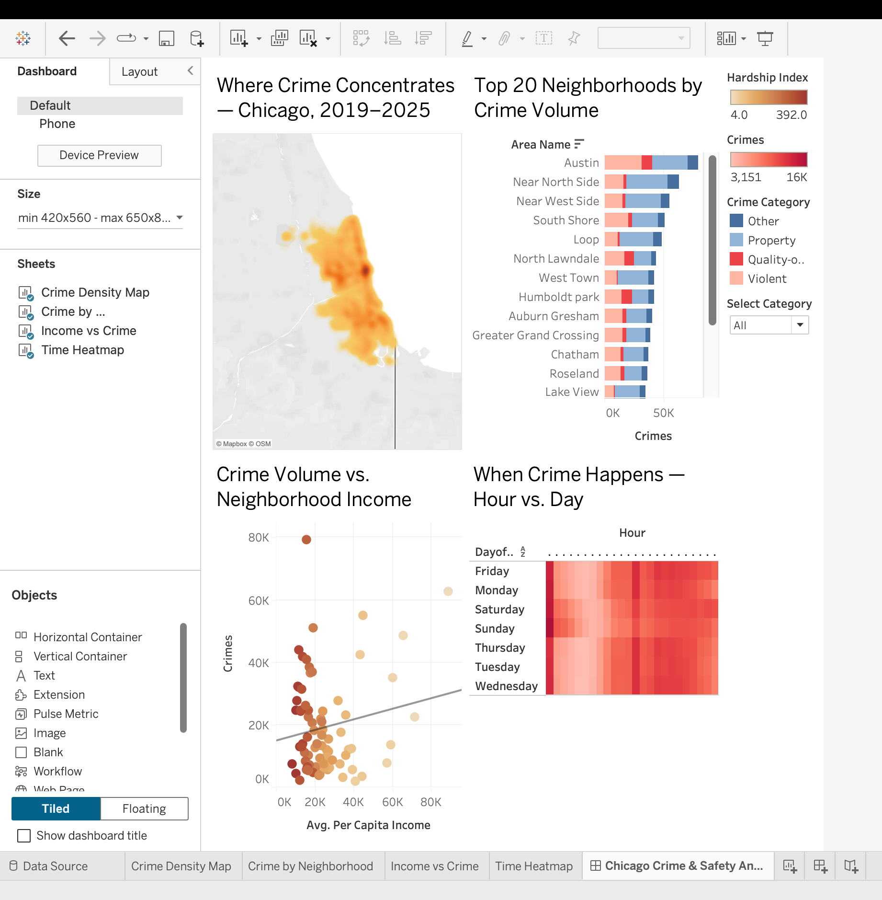

# Chicago Crime & Safety Analysis (2019–2025)

A geospatial and temporal analysis of **1.48 million** reported crimes in Chicago, built end-to-end in Python and visualized in an interactive Tableau dashboard.

### 🔗 [**View the live interactive dashboard on Tableau Public →**](https://public.tableau.com/views/ChicagoCrimeSafetyAnalysis2019-2025/ChicagoCrimeSafetyAnalysis20192025?:language=en-US&publish=yes&:sid=&:redirect=auth&:display_count=n&:origin=viz_share_link)



---

## Overview

This project studies neighborhood crime patterns across Chicago's 77 community areas using public data from the [Chicago Data Portal](https://data.cityofchicago.org/Public-Safety/Crimes-2001-to-Present/ijzp-q8t2). It answers four questions: **where** crime concentrates geographically, **when** it happens, **which** neighborhoods carry the most, and how crime relates to **neighborhood income and hardship**.

## Key Findings

- **Geographic concentration** — Crime clusters heavily on the West and South sides, with **Austin** the highest-volume community area; downtown areas (Loop, Near North) skew toward property crime near commercial districts.
- **Temporal patterns** — Crime peaks in the afternoon and evening hours, ramping up through the day and quietest in the pre-dawn hours; Friday and Saturday run hotter than weekdays.
- **The income–crime relationship is weaker than expected** — A regression of crime volume on per-capita income is statistically insignificant (R² ≈ 0.03, p ≈ 0.15): high crime appears at *both* income extremes for different reasons. The clearer signal is **hardship**, where the most distressed neighborhoods carry disproportionate crime volume.

> *Note: Crime volume is not population-adjusted, so high-volume areas partly reflect higher population/activity density.*

## Tech Stack

**Python** (pandas, sodapy, PyArrow) · **Tableau Public** · **Jupyter**

## Pipeline

The project is structured as a four-stage pipeline, one notebook per stage:

| Notebook | Stage | What it does |
|---|---|---|
| `01_ingest.ipynb` | **Ingest** | Pulls ~1.5M records from the Chicago SODA API using paginated, retry-hardened requests; caches to Parquet to avoid re-hitting the API. |
| `02_clean.ipynb` | **Clean** | Parses dates and derives time features, validates coordinates, confirms all 77 community areas, and groups 33 crime types into 4 categories. |
| `03_reference.ipynb` | **Reference** | Builds a community-area lookup with names, per-capita income, poverty rate, and hardship index for the equity analysis. |
| `04_aggregate.ipynb` | **Aggregate** | Joins crime data to the lookup and exports four purpose-built CSVs, each shaped for one dashboard view. |

## Dashboard

Built in Tableau Public with four linked views — a density heatmap, a neighborhood ranking, an income-vs-crime scatter, and an hour×day temporal heatmap — wired together with a **shared crime-category filter** (implemented via a parameter and calculated fields spanning multiple data sources).

## Reproducing

```bash
# clone and set up
git clone https://github.com/Mallika56/chicago-crime-analysis.git
cd chicago-crime-analysis
python3 -m venv venv && source venv/bin/activate
pip install -r requirements.txt

# run notebooks 01 → 04 in order
# (raw data regenerates from the API; large files are gitignored)
```

`01_ingest.ipynb` and `03_reference.ipynb` pull from the Chicago Data Portal anonymously (no
app token), which is rate-limited — a fresh `01_ingest` run pages through ~1.5M rows and can
take a while. CI validates notebook structure and syntax on every push; it doesn't execute the
pipeline, since that live pull isn't practical to run there.

## Data Sources

- [Crimes – 2001 to Present](https://data.cityofchicago.org/Public-Safety/Crimes-2001-to-Present/ijzp-q8t2) (Chicago Data Portal)
- [Census Data – Selected socioeconomic indicators by community area](https://data.cityofchicago.org/Health-Human-Services/Census-Data-Selected-socioeconomic-indicators-in-C/kn9c-c2s2)

---

*Built by Mallika Chourasia · Data through March 2025*
